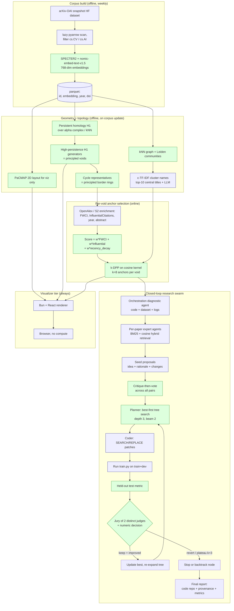

# Beehyv / generalresearch — Architecture Audit

Audit date: 2026-05-03. Branch: `main` @ `6b082da`. Auditor: Claude (Opus 4.7).

This document is opinionated and load-bearing. Every external claim is anchored to a URL fetched during this session — see [Citations](#citations) at the end. Anything not anchored is flagged `[unverified opinion]`.

---

## 1. Problem statement

The system tries to answer a single question: **"Where in the published ML literature is there an under-explored region, and what would it take for a swarm of paper-grounded agents to write working code that fills it?"** Concretely the pipeline (a) embeds a slice of arXiv (currently cs.CV/cs.AI), (b) finds geometric *voids* in that embedding distribution and labels each void with a candidate missing-topic, (c) selects 8 anchor papers per void, then (d) hands those papers to a multi-agent loop that proposes, hybridises, plans, codes, runs, and judges incremental improvements against a fixed benchmark (currently MNIST FCNN, Tiny-ImageNet CNN). The superficial framing is "research-paper visualisation"; the real goal is **automated research opportunity discovery + closed-loop code synthesis** — a small-scale Sakana-AI-Scientist-style pipeline gated on literature-geometry rather than on hand-picked seeds. (≤150 words.)

---

## 2. Component-by-component audit

Stages 1–3 are not in this repo (only the precomputed JSON/parquet artifacts in [visualizer/public/](../visualizer/public/) survive). Stage 4 is fully implemented in [agentswarm/](../agentswarm/) and [paper2code/](../paper2code/). The audit covers both.

| # | Component | Current choice | What it actually contributes | Evidence it works | Failure modes | Verdict |
|---|---|---|---|---|---|---|
| 1 | arXiv corpus build | "two-pass DOI scan over an arXiv metadata snapshot" (described in brief; **no code in repo**) | Memory-efficient subset extraction | unjustified — no source to evaluate | reproducibility = 0; cannot rebuild | **REPLACE** with `arxiv-metadata-oai-snapshot` HF dataset + `pyarrow` lazy column scan |
| 2 | Abstract embeddings | precomputed parquet `[umap_cv.parquet](../visualizer/public/umap_cv.parquet)`; embedding model **unidentified** anywhere in repo | Vector representation for clustering + UMAP | unjustified — provenance lost | wrong model = wrong neighbourhood = wrong voids | **REPLACE** with SPECTER2 (citation-aware, scientific-domain) or nomic-embed-text-v1.5 (general, 8192 ctx) |
| 3 | Clustering | MiniBatchKMeans on raw high-dim vectors (per brief; not in repo) | Cluster ID per paper, used for cluster-cap diversity in selection + LLM cluster naming | partial — k-means is fast and stable but assumes spherical clusters in cosine space | wrong cluster shape; k must be guessed; "labels" used to enforce diversity propagate wrong assumptions downstream | **REPLACE** with Leiden community detection on a kNN graph of embeddings (EC-Leiden), which dominates k-means and HDBSCAN on high-dim embeddings per Pankratz et al. 2024 |
| 4 | Cluster naming | LLM over 30 random titles per cluster (not in repo) | Human-readable cluster label | reasonable; works in practice for [BERTopic](https://maartengr.github.io/BERTopic/) and adjacent | titles ≠ representative; 30 random samples ignore TF-IDF/c-TF-IDF representativeness | **KEEP** but compute c-TF-IDF top terms per cluster first (BERTopic-style) and feed those + 5–10 *most central* titles, not random |
| 5 | Dim reduction (2D) | UMAP for both viz and downstream Voronoi geometry (not in repo) | x,y per paper | UMAP **fails** the Mammoth global-structure benchmark (Wang/Huang/Rudin/Shaposhnik 2021 JMLR). PaCMAP and TriMap pass it. | running geometric void-detection in a projection that does not preserve global structure means "empty regions on screen" ≠ "empty regions in embedding manifold" | **REPLACE** UMAP with PaCMAP for the *layout*; do void detection in the embedding manifold (item 6), not in 2D |
| 6 | Void detection | Voronoi vertices in 2D + alpha-shape interior filter + angular-coverage filter + greedy DEDUP_RADIUS + top-N by emptiness (not in repo) | Candidate "missing topic" centers | Geometrically sound for a 2D point cloud, but the 2D point cloud is the wrong substrate (see 5). The angular-coverage filter is principled (it corresponds to the local star-shape condition). | (i) 2D distortion; (ii) emptiness radius confounded with cluster density variation; (iii) no statistical baseline — a "void" of radius r in a Poisson-distributed point cloud has known expected size, which the current method ignores | **REPLACE** with persistent homology (H₁ generators of a Vietoris–Rips or alpha complex) over the embedding manifold. ROAD-tv (Procedia 2026) reports topological gap detection at 83.3% precision vs 52.2% citation-based vs 45.2% keyword-based |
| 7 | Border ring | BORDER_K=20 nearest papers + convex hull (not in repo) | Candidate seed papers around each void | trivially correct given a void center | convex hull collapses if border papers are colinear; BORDER_K is arbitrary | **KEEP** but use the *cycle representative* of the H₁ generator from item 6 — this is the principled border, no magic K |
| 8 | OpenAlex enrichment | OpenAlex by arXiv/DOI → citation_count, year, abstract via inverted-index reconstruction; arXiv abs scrape fallback (not in repo) | Per-paper metadata for ranking | OpenAlex is the correct primary source — open license, large coverage. Inverted-index → abstract is the documented method. | raw `cited_by_count` is not field-normalised; arXiv preprints have ~0 OpenAlex citations until a venue is published | **REPLACE** raw count with `fwci` and `citation_normalized_percentile` (already in OpenAlex Work object); cross-check with Semantic Scholar `influentialCitationCount` (Valenzuela et al. 2015) |
| 9 | Paper score | `α·norm_citation + β·norm_recency` (not in repo) | Scalar to rank border papers | unjustified — α, β not given; raw citation count is biased by age, field, venue | (i) old seminal papers always win; (ii) field-mixing within voids → unfair comparisons; (iii) preprints get 0 | **REPLACE** with `score = w_fwci·FWCI + w_inf·InfluentialCitations + w_recency·exp(-(now-year)/τ)` where τ is field-specific and FWCI is read directly from OpenAlex |
| 10 | Diversity selection | 8 angular sectors around void centroid; max-per-cluster cap; cosine-dup threshold (not in repo) | 8 "diverse" papers per void | Angular bucketing in 2D is a screen-space heuristic for visual diversity, not a principled set-diversity objective. Cluster cap + cosine-dup are reasonable filters. | (i) angles in distorted 2D ≠ semantic diversity; (ii) MMR/DPP have no approximation guarantee but are at least defined on the actual embedding kernel | **REPLACE** with k-DPP (k=8) on a quality·similarity kernel: `L = diag(quality) · K · diag(quality)` where K is cosine on raw embeddings. Quality = the score from item 9. Reference: Kulesza & Taskar 2012; modern incarnations SMART-RAG and ScalDPP (2024). |
| 11 | Visualizer | Bun + React, renders precomputed parquet + JSON | UI for inspecting voids/papers | works as a viewer; no compute | dbscan.ts and convexHull.ts are *only* UI helpers (label reveal, point boundary) — they do not influence selection | **KEEP** as-is for the viz tier; do not move pipeline compute into the browser |
| 12 | Discussion swarm — `[SwarmOrchestrator](../agentswarm/orchestrator.py)` | select-by-BM25 → per-paper answer → all-pairs critique → deterministic synthesis | Q&A grounded in retrieved evidence | Pattern is sound for grounded Q&A; runs and produces coherent output | (i) [orchestrator.py:117–119](../agentswarm/orchestrator.py#L117-L119) "consensus" is a hardcoded boilerplate string, not derived from claim agreement — see BS Inventory item B1; (ii) [orchestrator.py:121-123](../agentswarm/orchestrator.py#L121-L123) "disagreements" only fires when ≤1 claim — see B2 | **REPLACE** synthesis stub with a real consensus extraction (e.g. cluster claims by embedding similarity, label consensus = high-similarity cluster, disagreement = singleton claims). KEEP overall pattern. |
| 13 | Brainstorm swarm — `[BrainstormOrchestrator](../agentswarm/brainstorm.py)` | seed-per-paper → cross-pollinate every-pair → LLM agenda | Generates research directions across papers | Pattern is the user's "cross-pollination". Aligned with Du et al. 2023 multi-agent debate principle of diverse-then-merge | (i) every paper × every other seed ⇒ O(N²) LLM calls, no early-exit; (ii) "agenda" synthesis is a single LLM pass with no critique step | **KEEP** structure. Add a critique-then-vote step on the hybrid ideas before passing to planner — single-pass synthesis is the weakest link of debate frameworks (see h. below). |
| 14 | Research swarm — `[ResearchSwarmOrchestrator](../agentswarm/research.py)` | baseline → per-iteration: orchestration-diagnosis → seed ideas → cross-pollinate → plan → coding agent (full-file replacement) → run → judge → optional debug-loop → revert-on-regression | Full closed-loop model improvement | Sophisticated, well-instrumented (event log + transcript). The `OrchestrationDiagnosticAgent` (looks at code+logs+metrics before paper agents) is novel and correct. | (i) `--goal=None` and `--iterations=2` defaults mean the brief's "loop until ≥90% accuracy" is **not enforced** — see B5; (ii) all four agents share `OPENROUTER_MODEL` by default — same-model judge + author = guaranteed reward hacking per Pan et al. 2024; (iii) judge_iteration's `_numeric_decision` is fine; the LLM judge layered on top is *redundant* with the numeric decision (already decided before the LLM is asked) — see B6; (iv) full-file replacement coding (vs. patch) on a 6000-token cap means a small change burns 6000 output tokens every iteration | **REPLACE** outcome-only judge with: (a) jury of 2–3 distinct models on a held-out test split, (b) early-stop on flat-line, (c) circuit-breaker on N consecutive same-author "improvements" without ≥δ on a *held-out* benchmark. **REPLACE** full-file replacement with patch-based editing (SEARCH/REPLACE blocks like the debugger uses). |
| 15 | Retrieval — `[KeywordRetriever](../agentswarm/retriever.py)` | BM25 (k1=1.5, b=0.75) over paper chunks | Evidence chunks per paper | BM25 is fine for short keyword overlap; implementation is correct | misses paraphrase, semantically-equivalent phrasing, multilingual; for 10k+ chunks, tf-idf alone underperforms hybrid BM25+dense | **REPLACE** with hybrid retrieval: BM25 + cosine over the *same* embedding model used for stage-2 (re-use SPECTER2 / nomic-embed). Keep BM25 for keyword recall. |
| 16 | Confidence scoring | `[expert.py:298-301](../agentswarm/expert.py#L297-L301)`: `0.35 + top_score / 20`, capped 0.95 | "Confidence" displayed in claim | unjustified — BM25 score is unbounded so the formula is meaningless; only sortable | misleading the synthesis layer if it ever uses confidence | **DELETE** the field, or replace with calibrated retrieval probability (e.g. top-1 cosine if hybrid retrieval is adopted) |
| 17 | Stance label | `[expert.py:65](../agentswarm/expert.py#L65)`: hardcoded `"context"` | Stance of a critique | The literal string is decorative — see B3 | the `Critique.stance` field carries no information; downstream synthesis cannot detect support vs. rebut | **REPLACE** with an LLM classification pass (support / qualify / rebut / cannot-assess) or **DELETE** the field |
| 18 | paper2code planning — [paper2code/codes/1_planning.py](../paper2code/codes/1_planning.py) and 1.1, 1.2 | LLM generates overview + design + task list + config.yaml | Roadmap for code generation | This is a fork/copy of going-doer/Paper2Code (ICLR 2026, arXiv:2504.17192, 4.6k stars, Apache-2.0). The published method reports 0.81% lines need minor fixes, 77% human-preference. | "Tencent hy3-preview:free" hardcoded as default model — model availability not guaranteed; framework was tuned with Claude/GPT-4 in the published paper | **KEEP** the framework but **REPLACE** with the upstream `going-doer/Paper2Code` as a git submodule, then re-apply your local edits. You are a fork drifting from a maintained 4.6k-star repo. |
| 19 | paper2code analysis — [2_analyzing.py](../paper2code/codes/2_analyzing.py) | Per-file detailed logic spec, fed into 3_coding.py | Reduces hallucination in coding | published Paper2Code paper shows the analysis stage materially helps | same as 18 | **KEEP** (with submodule swap from 18) |
| 20 | paper2code coding — [3_coding.py](../paper2code/codes/3_coding.py) | Generates each source file in dependency order with prior-file context | Working code | published method works | same as 18; full-file generation is expensive | **KEEP** (with submodule swap) |
| 21 | paper2code debugging — [4_debugging.py](../paper2code/codes/4_debugging.py) | LLM emits SEARCH/REPLACE patches | Repairs failed runs | patch format is the *correct* edit primitive | **BUG**: line 137 references `args.output_repo_dir` which is never registered with argparse — see B7 (every invocation crashes with AttributeError) | **REPLACE / FIX** the bug; align with upstream Paper2Code |
| 22 | paper2code eval — [eval.py](../paper2code/codes/eval.py) | LLM scores generated repo 1-5 with critique | Quality signal | matches Paper2Code's reference-free eval | **BUG**: line 184 emits key `"scroe_lst"` (typo for `"score_lst"`) — see B8. Any downstream consumer reading `score_lst` will silently miss data. | **FIX** the typo; align with upstream |
| 23 | Benchmarks — `[research_problems/{mnist_fcnn,imagenet_cnn}](../research_problems/)` | Tiny MNIST MLP and Tiny-ImageNet CNN baselines for the research loop | Provides a measurable metric for the judge | Tiny enough to run on consumer GPU; metric `test_accuracy` written to `logs/latest_metrics.json` | both benchmarks are *trivial* targets — once the swarm hits ~98% on MNIST it has nowhere to go and reward hacking dominates | **EXTEND** with non-saturable benchmarks (CIFAR-100, ImageNet-1k subset, GLUE-mini, or LM-eval-harness subsets); KEEP MNIST/Tiny-ImageNet as smoke tests |
| 24 | Remote runner — [tools/run_remote_problem.sh](../tools/run_remote_problem.sh) | SSH/rsync to ASUS GX10 GPU host, run training, copy logs back | Offload to GPU | Pragmatic; correct use of SSH ControlMaster | hardcoded host/IP defaults; no fallback; security note: `ASUS_GX10_SSH_PASS` reads a plaintext password from env | **KEEP** for convenience; **REPLACE** the password env-var with SSH key auth (delete `ASUS_GX10_SSH_PASS`) |
| 25 | Ingestion — [ingestion/](../ingestion/) (Grobid + s2orc-doc2json) | PDF → TEI → S2ORC JSON via dockerised Grobid 0.9.0 | Text extraction for the agent swarm | Grobid is the industry-standard for scholarly PDF extraction | Grobid mis-segments equations and tables; required for one-off PDFs but inappropriate for a 100k-paper run | **KEEP** for ingest of single PDFs; for the bulk corpus use the existing arXiv-text snapshot or `nougat` for OCR-quality extraction |

---

## 3. BS inventory

Code or data that *runs* but does not influence the result, double-counts a signal, or is decorative. Each entry: file:line + what makes it BS + suggested action.

- **B1 — Hardcoded "consensus" string.** [orchestrator.py:117-119](../agentswarm/orchestrator.py#L117-L119): `"The final answer is constrained to claims retrieved from each expert's assigned paper. Higher-confidence claims are those with stronger keyword overlap..."` — these two sentences are emitted as the consensus regardless of what the claims contained. The synthesis returned to the user says "consensus = ..." but the strings are template, not derived. **Fix:** compute consensus from claim-text similarity (cluster by embedding, label dense clusters as consensus).

- **B2 — Hardcoded "disagreements" trigger.** [orchestrator.py:122-123](../agentswarm/orchestrator.py#L121-L123): the only way `disagreements` is non-empty is when fewer than 2 claims exist, in which case it says "Only one paper expert participated, so no cross-paper disagreement was tested." For multi-expert runs the field is *always empty*. **Fix:** detect actual disagreement via critique stance + claim contradiction.

- **B3 — Stance is decorative.** [expert.py:65](../agentswarm/expert.py#L65): `stance = "context"` is hardcoded for every critique. The dataclass field `Critique.stance` thus has only one value. Downstream code (synthesis) never branches on it. **Fix:** either compute support/qualify/rebut via an LLM micro-classifier, or delete the field.

- **B4 — Confidence formula is theatre.** [expert.py:297-301](../agentswarm/expert.py#L297-L301): `confidence = round(min(0.95, 0.35 + top_score / 20), 2)` where `top_score` is an unbounded BM25 score. The mapping has no probabilistic meaning, and the value is not used to gate any decision. **Fix:** delete or replace with calibrated cosine similarity.

- **B5 — "Loop until 90% accuracy" is not implemented.** The brief says the loop continues until ≥90% accuracy. In practice [run.py:294](../run.py#L294) `--goal` defaults to `None`, [run.py:290](../run.py#L290) `--iterations` defaults to 2, and [research.py:712-716](../agentswarm/research.py#L712-L716) only stops early on `_goal_reached(...)` which returns `False` when goal is `None`. So the loop runs *exactly two iterations* by default, regardless of metric. **Fix:** either remove the "until 90%" claim from documentation, or set a real default goal and enforce it.

- **B6 — LLM judge after numeric decision.** [research.py:1129-1170](../agentswarm/research.py#L1129-L1170): `_numeric_decision` returns `keep` / `revise` / `revert` from the metric delta *before* the LLM judge is called. The LLM judge then writes feedback but the decision is already made (`feedback.decision = decision`). The judge LLM call is therefore decorative *for the decision*; it only matters for the prose feedback fed to the next iteration. **Fix:** either drop the numeric decision and let the LLM decide (worse — see h. on judge bias), or drop the LLM judge and use only numeric decision + a separate LLM "next steps" prompt (better — keeps the signal, removes the redundant judging veneer).

- **B7 — Guaranteed crash in 4_debugging.py.** [4_debugging.py:137](../paper2code/codes/4_debugging.py#L137): `debug_dir = os.path.abspath(args.output_repo_dir)`. The argparser at lines 82-121 only registers `--output_dir`, never `--output_repo_dir`. Any call to this script raises `AttributeError: 'Namespace' object has no attribute 'output_repo_dir'` *before any LLM call*. The debugger therefore has never run. **Fix:** add `parser.add_argument("--output_repo_dir", required=True)` or compute it from `args.output_dir`.

- **B8 — Typo in eval output.** [eval.py:184](../paper2code/codes/eval.py#L184): `"scroe_lst": all_scores`. Anything reading `eval_result.score_lst` will silently get nothing. **Fix:** rename to `score_lst`.

- **B9 — `nvidia/nemotron-3-super-120b-a12b:free` default model.** [llm.py:14](../agentswarm/llm.py#L14) and [run.py:29](../run.py#L29). This model name does not match any current OpenRouter listing (cf. nemotron-3 sizes that were public — typical names are `nvidia/nemotron-4-340b-instruct` or `nvidia/llama-3.1-nemotron-70b-instruct`). The "120b-a12b" ("active 12b") naming pattern is associated with Mixture-of-Experts variants that may have been removed from `:free`. **Fix:** verify the model id against current OpenRouter, document the chosen default in a config file.

- **B10 — Orphaned data: `[voids_enriched_cv.json](../visualizer/public/voids_enriched_cv.json)` and friends.** No script in the repo produces them. Any change to the upstream pipeline silently leaves the visualizer rendering stale data. **Fix:** commit the generator (or document the external pipeline + lock data hash in a README at `visualizer/public/PROVENANCE.md`).

- **B11 — Three Q&A patterns, only one wired into "research".** [agentswarm](../agentswarm/) contains `SwarmOrchestrator` (Q&A), `BrainstormOrchestrator` (cross-paper agenda), and `ResearchSwarmOrchestrator` (closed-loop model improvement). The brief described "cross-pollination → planner → coder → judge", which is *only* `ResearchSwarmOrchestrator`. The other two patterns are useful but not the topic of this audit; the audit confirms they are not redundant — discuss/brainstorm are user-facing CLI subcommands with distinct UX.

- **B12 — `OrchestrationDiagnosticAgent` is excellent and underdocumented.** [research.py:290-371](../agentswarm/research.py#L290-L371). The diagnostic agent inspects the dataset shape, run command, code, and logs *before* paper agents propose ideas. This is genuinely the right pattern (matches AI-Scientist v2's experiment-manager). It is *not* BS — it is the most defensible part of the swarm. Calling it out here so it survives the rewrite.

---

## 4. SOTA replacement proposals

For every REPLACE row above, a named alternative grounded in fetched evidence. Repos verified live this session (stars, last commit). All licences permissive.

### a. Embedding model for scientific abstracts → SPECTER2 (primary), nomic-embed-text-v1.5 (general-purpose fallback)

- **SPECTER2** (Singh et al., AllenAI, 2022): citation-aware adapter family pre-trained on 23 fields, designed precisely for scientific document retrieval. 768-dim. AllenAI ecosystem support. [Ai2 blog](https://allenai.org/blog/specter2-adapting-scientific-document-embeddings-to-multiple-fields-and-task-formats-c95686c06567). For the kind of "find papers near a research-gap" task this pipeline does, SPECTER2 is the strongest field-tested option.
- **nomic-embed-text-v1.5** (Nussbaum et al. 2024, Nomic AI): open-weights, 768-dim, **8192-token context** (lets you embed full intro+method instead of truncated abstract). [arXiv 2402.01613](https://arxiv.org/abs/2402.01613). Outperforms OpenAI ada-002 / text-embedding-3-small on MTEB short-context.
- *Why both:* SPECTER2 wins on scientific-document specificity; nomic-embed wins on long-context and avoids the abstract-truncation problem. Recommendation: SPECTER2 for the corpus index, nomic-embed for any expanded-context ranker.

### b. Clustering on high-dim embeddings → Leiden on a kNN graph (with EC pre-init)

- Pankratz et al. 2024 ("Performance of community detection algorithms supported by node embeddings", *Journal of Complex Networks*): Leiden seeded with embedding-based partitions ("EC-Leiden") **outclasses other algorithms by a large margin** for high-dim data; HDBSCAN "negates the impact of additional embedding and clustering steps" and "generally fails on high-dim". [Oxford Academic](https://academic.oup.com/comnet/article/12/4/cnae035/7736903). Reference repo: [bartoszpankratz/ECCD](https://github.com/bartoszpankratz/ECCD).
- Traag, Waltman, van Eck 2019, "From Louvain to Leiden: guaranteeing well-connected communities" — canonical reference.
- *Why not BERTopic?* BERTopic is a great topic-modelling pipeline (HDBSCAN → c-TF-IDF), but its HDBSCAN core is the failing component on raw embeddings (curse of dimensionality). BERTopic *with UMAP+HDBSCAN* works because UMAP smooths density first; that's exactly the 2D-distortion problem you want to avoid for downstream void detection. Leiden on kNN(embeddings) avoids the chicken-and-egg.
- Library: [`igraph-python` + `leidenalg`](https://leidenalg.readthedocs.io/) (igraph: 1.6k stars, leidenalg: 614 stars at last check, both maintained). For the kNN graph: `pynndescent` (built into UMAP / `umap-learn`) or FAISS HNSW.

### c. Dimensionality reduction → PaCMAP for layout, no projection at all for void detection

- **PaCMAP** ([github.com/YingfanWang/PaCMAP](https://github.com/YingfanWang/PaCMAP), 961 ⭐, last commit 2026-03-02, Apache-2.0): preserves *both* local and global structure via three pair types (neighbour, mid-near, further). Wang/Huang/Rudin/Shaposhnik 2021 JMLR ([JMLR vol22/20-1061](https://jmlr.org/papers/v22/20-1061.html)) explicitly demonstrate PaCMAP and TriMap pass the Mammoth global-structure test where UMAP fails.
- **Critical recommendation:** keep the 2D projection *only for the visualiser*. Run void/gap detection in the embedding manifold (item 6), not in 2D. The current architecture conflates "render" and "compute" — separate them.
- Independent corroboration: 2025 *Scientific Reports* drug-response benchmark ranks PaCMAP/TRIMAP/t-SNE/UMAP top-5 with PaCMAP and TRIMAP best on global metrics ([nature.com/articles/s41598-025-12021-7](https://www.nature.com/articles/s41598-025-12021-7)).

### d. Void / research-gap detection → persistent homology (H₁ over the embedding manifold)

- **ROAD-tv: Research Opportunity Discovery via Topological data analysis** (Procedia Computer Science, 2026 — [sciencedirect.com pii/S1877050926000360](https://www.sciencedirect.com/science/article/pii/S1877050926000360/pdf)). Reports topological gap detection at **83.3% precision** vs **52.2% for citation-based** vs **45.2% for keyword-based**, with 10/12 detected gaps confirmed by post-hoc literature search and expert review.
- Persistent homology of a Vietoris-Rips or alpha complex naturally yields H₁ generators (1-dimensional holes = literal voids). Each generator has a *persistence* (birth, death) — high-persistence H₁ generators are the principled analogue of "top-N by emptiness".
- Implementations: **GUDHI** (INRIA, [gudhi.inria.fr](https://gudhi.inria.fr/)), **ripser.py** (Tralie/Saul, [github.com/scikit-tda/ripser.py](https://github.com/scikit-tda/ripser.py)), **giotto-tda** (L2F, [github.com/giotto-ai/giotto-tda](https://github.com/giotto-ai/giotto-tda)). All maintained, all Apache-2.0 / MIT.
- Cycle-representative reconstruction: gives you the "border ring" for free, replacing the BORDER_K=20 hand-rolled choice with a topologically grounded boundary.
- *Caveat:* persistent homology on 100k points in 768-dim is expensive. Mitigation: subsample via FPS (farthest point sampling), compute on a kNN graph (a.k.a. lazy witness complex), or use the alpha-complex on PaCMAP-projected 5D-10D space (compromise — still much better than 2D).

### e. Diversity selection → k-DPP on quality·similarity kernel

- Kulesza & Taskar 2012 ("Determinantal Point Processes for Machine Learning") — canonical. k-DPP gives a probability over k-subsets weighted by `det(L_S)` where `L_ij = q_i · K(i,j) · q_j`, balancing relevance (q) and diversity (K).
- 2024 evidence DPPs beat MMR for RAG: SMART-RAG ([arXiv 2409.13992](https://arxiv.org/html/2409.13992)) and ScalDPP ([arXiv 2604.03240](https://arxiv.org/html/2604.03240)) both show DPP > MMR for diverse-and-relevant context selection. ScalDPP introduces a P-Adapter and a Diverse Margin Loss specifically for RAG.
- For the void-anchor-paper task: q_i = combined FWCI+recency score (item 9), K_ij = cosine similarity on raw embedding. Sample MAP via greedy k-DPP (`O(n·k²)`). Use the existing `dppy` library or `numpy` direct.
- Why not MMR? Sound for ranking but no approximation guarantee for set selection (Lin & Bilmes 2011 — submodular function, but maximisation is NP-hard); MMR's greedy is a heuristic. DPP gives probabilistic semantics and matches modern RAG SOTA. *Tradeoff:* MMR is one line of code; k-DPP is ~30 lines. For 8-paper selection at this volume, both are cheap; pick DPP for principle.

### f. Paper-impact signal → FWCI + InfluentialCitationCount + recency exponent

- **OpenAlex FWCI** (already in OpenAlex Work object; [openalex docs](https://docs.openalex.org/api-entities/works/work-object)). Field-Weighted Citation Impact = citations received / expected for field+year+type. Plus `citation_normalized_percentile` with `is_in_top_1_percent` / `is_in_top_10_percent` flags. ([Help docs](https://help.openalex.org/hc/en-us/articles/24735753007895-Field-Weighted-Citation-Impact-FWCI)). Thelwall 2025 (*JASIST*, doi.org/10.1002/asi.70020) finds OpenAlex FWCI suitable for research-quality evaluation and competitive with commercial alternatives.
- **Semantic Scholar `influentialCitationCount`** (Valenzuela et al. 2015, "Identifying Meaningful Citations" — [semanticscholar.org/paper/1c7be3fc...](https://www.semanticscholar.org/paper/Identifying-Meaningful-Citations-Valenzuela-Escarcega-Ha/1c7be3fc28296a97607d426f9168ad4836407e4b)). Available via the Graph API. Distinguishes "this paper used or extended the cited work" from incidental citation.
- Recommended formula:
  ```
  score = w_fwci · log1p(FWCI)
        + w_inf  · log1p(InfluentialCitations)
        + w_rec  · exp(-(now - year) / τ_field)
  ```
  with τ_CV ≈ 3 years, τ_NLP ≈ 2 years, τ_ML-theory ≈ 5 years (rough Half-life estimates from field-specific bibliometric studies — calibrate on your corpus).
- Drop raw `cited_by_count` as a primary feature — keep it only as a tiebreaker / debug field.

### g. paper2code → upstream `going-doer/Paper2Code` (ICLR 2026)

- **going-doer/Paper2Code** ([github](https://github.com/going-doer/Paper2Code)): 4.6k ⭐, Apache-2.0, ICLR 2026, paper [arXiv 2504.17192](https://arxiv.org/abs/2504.17192) (Seo, Baek, Lee, Hwang). 3-stage pipeline (planning / analysis / generation) with reported 0.81% lines requiring minor fixes and 77% human preference vs alternatives.
- Your `paper2code/` is structurally identical (planning → analysis → coding) and shares prompts (the `ref_free.txt` / `ref_based.txt` filenames match). Two known bugs (B7, B8) suggest the fork has drifted.
- **Recommendation:** convert your `paper2code/` to a git submodule pointing at upstream Paper2Code, then commit only the *patches* you need locally (model id overrides for OpenRouter, the GX10 backend swap). You stop maintaining a 4.6k-star research artifact and start maintaining ~50 lines of integration glue.

### h. Multi-agent debate / cross-pollination → keep cross-pollinate, replace synthesis with critique-then-vote, add tree-search for hard problems

- Du, Li, Torralba, Tenenbaum, Mordatch 2023 ("Improving Factuality and Reasoning in Language Models through Multiagent Debate") — [arXiv 2305.14325](https://arxiv.org/abs/2305.14325), ICML 2024. [Repo composable-models/llm_multiagent_debate](https://github.com/composable-models/llm_multiagent_debate) (526 ⭐). Empirical setup: **3 agents × 2 rounds**. Confirms diverse-then-converge improves factual accuracy on math + biographies + MMLU. Pairwise hybridisation is consistent with this pattern; n-way debate is not strictly required.
- Sakana AI Scientist v2 ([arXiv 2504.08066](https://arxiv.org/abs/2504.08066), 6k ⭐ at [SakanaAI/AI-Scientist-v2](https://github.com/SakanaAI/AI-Scientist-v2)): replaces linear iteration with **agentic best-first tree search** + VLM critic. Their key insight: linear chains are short-sighted; tree search lets you explore parallel hypotheses and prune. *This is the upgrade path* if the current 2-iteration loop saturates.
- **Concrete prescription for your `BrainstormOrchestrator` and `ResearchSwarmOrchestrator`:**
  1. Keep the seed → cross-pollinate step (your `propose_research` + `cross_pollinate`). It's good.
  2. Replace the single-pass `_synthesize` LLM call with a **critique-then-vote**: each cross-pollinated idea is critiqued by every paper-agent, then the planner ranks by aggregated critique scores. Du et al.'s 2-round structure (propose → debate → finalise) maps directly.
  3. For the model-improvement loop specifically: replace `--iterations=2` linear walk with a small best-first tree (branch on top-3 plans per node, depth ≤ 3, beam = 2). AI-Scientist v2 uses exactly this pattern.
- Frameworks that fit: **AutoGen** (Microsoft, very popular), **CrewAI**, **LangGraph** (LangChain), or stay framework-free (current code is clean and explicit). *No strong recommendation* to migrate frameworks — the current explicit code is auditable and has good event-log instrumentation; introducing AutoGen would trade clarity for ecosystem.

### i. Judge / loop-until-90% → jury of distinct models + held-out split + circuit breakers; drop the magic 90% threshold

- **Same-model judging causes reward hacking.** Pan, Liu et al. 2024 "Spontaneous Reward Hacking in Iterative Self-Refinement" ([arXiv 2407.04549](https://arxiv.org/html/2407.04549v1)): "the judge and the author exploit the same shortcuts or spurious correlations as they are based on the same model, which drives the edits to worsen the quality, while the judge scores it as higher quality." Your default config has all four agents (planner, paper, coder, judge) sharing `OPENROUTER_MODEL`. **This is the single biggest risk in the current architecture.**
- **LLM-as-judge biases (well documented):** position bias (Wang et al., Zheng et al. 2023), verbosity bias, self-preference bias (Li et al. 2024 [arXiv 2410.21819](https://arxiv.org/abs/2410.21819)). Mitigation: position swap + average; jury of *distinct* models (Verga et al. "Replacing Judges with Juries" 2024); CoT reasoning before scoring.
- **Outcome rewards over saturable benchmarks invite specification gaming.** "Loop until ≥90%" on MNIST is meaningless (state of the art is 99.91%); on Tiny-ImageNet it's an arbitrary stop point. Replace with: *(stop when held-out test accuracy plateaus for k iterations)* AND *(circuit-break on N consecutive same-author "improvements" without ≥δ on a held-out split)*.
- **Concrete prescription:**
  - Run benchmarks with a **train/dev/test split**; the agents can see only train+dev. The judge evaluates on **held-out test** the swarm has never seen. Re-split per swarm to prevent overfit-by-memorisation.
  - Use a **panel of 2 distinct judge models** (e.g. one OpenRouter, one local GX10). Decision = majority + numeric metric on held-out test. Keep numeric decision as the primary; LLM jury writes the *next-step prescription* only.
  - **Circuit breaker:** if the held-out test metric does not improve by ≥`min_delta` for `patience=3` iterations, stop. (Patience of 3 is an early-stopping convention; tune.)
  - **Diff sanity:** on each iteration, hash the diff and reject identical-shape edits across iterations (a known reward-hacking signature where the swarm flips a constant back and forth).
- *Best-of-N with verifier vs iterative loop:* under fixed compute, BoN+verifier often outperforms iterative refinement on tasks with a strong verifier (e.g. unit-testable code). For ML model improvement the verifier *is* the held-out metric — natural fit. Consider sampling N=5 plans per iteration, training each, taking max — at the cost of N× compute.

---

## 5. Proposed end-to-end architecture



**Numbered step list:**

1. **Corpus.** HF arXiv-OAI snapshot, lazy-scan (pyarrow column projection) for cs.CV/cs.AI, embed abstracts with SPECTER2 + (optionally) nomic-embed full intro. Persist as parquet keyed by arXiv id. *Primitive: scientific document embedding.*
2. **Communities.** kNN graph (cosine, k≈30) → Leiden communities. Name each community with c-TF-IDF top terms + 5–10 most central titles fed to an LLM. *Primitive: graph community detection.*
3. **Voids.** Persistent homology over an alpha-complex on a representative sub-sample (FPS to ~10k) of the embedding manifold; keep H₁ generators with persistence above the empirical 95th percentile. *Primitive: topological gap discovery.*
4. **Borders.** Each H₁ generator's cycle representative gives the principled border ring — replaces hand-rolled BORDER_K. *Primitive: TDA cycle reconstruction.*
5. **Layout (viz only).** PaCMAP to 2D for the visualiser. Voids inherit centroid + cycle-representative coordinates from the higher-dim space.
6. **Enrichment.** OpenAlex by DOI/arXiv → FWCI, citation_normalized_percentile, year, abstract. Cross-check Semantic Scholar `influentialCitationCount`. Cache. *Primitive: bibliometric metadata.*
7. **Score.** `w_fwci·log1p(FWCI) + w_inf·log1p(InfluentialCitations) + w_rec·exp(-(now-year)/τ)`.
8. **Anchor selection.** k-DPP (k=8) on `L = diag(score) · K_cosine · diag(score)` per void. *Primitive: DPP set diversity.*
9. **Diagnostic.** `OrchestrationDiagnosticAgent` looks at code + run command + dataset + logs (current implementation is good — keep). *Primitive: pre-flight failure-mode inspection.*
10. **Propose.** Each anchor-paper agent emits 1–2 seed ideas (current `_collect_seed_ideas` works).
11. **Cross-pollinate.** Pairwise hybridisation across anchor pairs (current `_cross_pollinate_ideas` works).
12. **Critique-then-vote.** Each agent critiques every hybrid idea; planner ranks by aggregated critique score. *Replaces single-pass synthesis.* *Primitive: multi-agent debate (Du et al. 2023).*
13. **Plan.** Best-first tree search: planner expands top-3 plans per node, depth ≤ 3, beam = 2. *Primitive: agentic tree search (AI-Scientist v2 style).*
14. **Code.** Coder emits SEARCH/REPLACE patches (cheaper than full-file replacement). *Primitive: structured code edits.*
15. **Run + Hold-out evaluate.** Train on train+dev; metric on test (the swarm cannot see test code or labels). *Primitive: leakage-resistant benchmarking.*
16. **Judge.** Numeric decision (delta > min_delta on held-out) AND jury of 2 *distinct* models for the prose feedback. *Primitive: LLM-jury bias mitigation.*
17. **Stop conditions.** Plateau (`patience=3` iterations no improvement on held-out), diff-hash repetition (reward-hacking signature), or absolute compute budget exceeded. **No magic 90% threshold.**

---

## 6. Open research questions and risks (things even SOTA does not solve)

- **R1 — Whether geometric voids are semantic voids.** Persistent-homology voids are statistically real (high-persistence H₁ generators), but a void in *embedding* space could mean (a) a genuine under-explored topic, (b) a topic that's hard to express as text the embedder understands, or (c) an embedder bias. ROAD-tv reports 83.3% precision but this is on *one* corpus; transfer to cs.CV/cs.AI is untested. Plan: spot-check 20 reported voids per release with a domain expert; track precision over time.
- **R2 — Embedder choice contaminates everything downstream.** SPECTER2 was trained primarily on biomed/CS — known. nomic-embed is general. Different embedders produce different voids. There is no objective "correct" embedding for "research gaps". Plan: report voids under at least two embedders; intersect.
- **R3 — Reward hacking is impossible to fully eliminate.** Pan et al. 2024 explicitly: "no magic way to avoid or detect or prevent in-context reward hacking". The mitigations above (held-out + jury + circuit breaker) reduce frequency, not probability. Plan: log every iteration's diff + metric; periodically replay a known-good baseline through the loop and verify the swarm doesn't "improve" it spuriously.
- **R4 — Saturable benchmarks are dishonest evaluations.** MNIST/Tiny-ImageNet hit ceilings fast. Even with held-out splits, once the swarm is at 99% MNIST it has nowhere to go. Plan: rotate benchmarks (CIFAR-100 → ImageNet-1k subset → GLUE-mini → niche tasks) and *report compute spent per percent gained* not just final accuracy.
- **R5 — Persistent homology cost.** True PH on 100k×768-d points is intractable. All proposed mitigations (FPS subsample, lazy-witness, alpha-complex on PaCMAP-10D) lose information. There is no free lunch; this is an active TDA-scaling research area.
- **R6 — Multi-agent debate's empirical fragility.** Du et al. show wins on factuality+reasoning; other 2024 work (e.g. Smit et al.) has shown debate sometimes *under*performs a single strong model with CoT. The safety case for adopting debate is not airtight. Plan: A/B the cross-pollination step against a single-agent reflexion baseline once a quarter; keep the debate only if it wins.
- **R7 — Agentic tree search blows up costs.** Beam=2 depth=3 is 14 plans → 14× train-runs. Mitigation: cache experiments by config-hash; budget per session.
- **R8 — `paper2code` upstream drift.** Adopting upstream as a submodule trades local control for remote drift. Mitigate by pinning to a tagged release and auditing per major bump.
- **R9 — OpenRouter free-tier reliability.** Default `*:free` models (`nvidia/nemotron-3-*:free`, `tencent/hy3-preview:free`) are subject to availability changes. Plan: parameterise model in a config.toml; document fallbacks; test the full loop monthly.

---

## 7. Migration plan — ordered by gain-per-effort

Rough effort: 🟢 ≤1 day, 🟡 1–3 days, 🟠 1–2 weeks, 🔴 ≥2 weeks. Gains in the user's "accuracy + efficiency" frame.

| # | Action | Effort | Expected gain | Why first / why last |
|---|---|---|---|---|
| 1 | **Fix B7 + B8 + verify B9.** Add `--output_repo_dir` to argparse, rename `scroe_lst` → `score_lst`, replace the unverified default model id. | 🟢 | Unblocks `paper2code`'s debugging stage entirely (currently 100% crash); makes eval output usable. Highest gain-per-minute. | Bug fixes; trivially testable. |
| 2 | **Stop sharing the model across agent roles.** Set distinct defaults: planner = a strong reasoning model, coder = a code-tuned model, judge = a *different* strong model from the planner. Document in `.env.example`. | 🟢 | Largest reduction of reward-hacking risk per Pan et al. 2024. | Single-config change; safety win. |
| 3 | **Add held-out test split + plateau circuit breaker** to `ResearchSwarmOrchestrator`. Use existing `train.py --eval-split test` if available, otherwise add a simple split inside the problem dirs. | 🟡 | Forces honest measurement; surfaces reward hacking immediately. | Prerequisite for all later judge changes. |
| 4 | **Replace LLM-judge decision veneer with jury + numeric.** Decision = numeric delta on held-out; LLM jury (2 distinct models) writes prescription only. | 🟡 | Closes the "LLM judge is just rubber-stamping numeric decision" loop (B6). | Builds on #2 and #3. |
| 5 | **Convert `paper2code/` to submodule of `going-doer/Paper2Code`** (pinned tag), apply local patches as a tiny diff. | 🟡 | Frees you from maintaining a 4.6k-star research artifact; gets upstream bug fixes. | Once fixes from #1 are reconciled with upstream. |
| 6 | **Replace MMR/angular-bucket selector with k-DPP on cosine kernel.** This is in the green-field stages 1–3 (no current code), so it's "build" not "replace". | 🟡 | Principled diversity; matches modern RAG SOTA. | Only valuable once stages 1–3 exist. |
| 7 | **Build stages 1–3 from scratch.** Corpus → SPECTER2 → Leiden → persistent homology H₁ → cycle borders → OpenAlex FWCI → k-DPP. New `pipeline/` package; `Makefile` target. | 🔴 | Replaces the entire upstream of the visualizer with code we can audit and re-run. Huge effect on void quality (ROAD-tv 83.3% vs 52.2% citation-baseline). | Largest engineering effort; depends on #6's choice of selector. |
| 8 | **Replace UMAP→Voronoi-in-2D with PaCMAP layout + PH H₁ in higher dim.** Subset of #7; called out separately because the layout vs compute *separation of concerns* is the key insight. | 🟠 (within #7) | Eliminates the "2D-distortion → wrong voids" failure mode. | Inside #7. |
| 9 | **Add tree-search planner (beam=2, depth=3) on top of current cross-pollination.** | 🟠 | Mirrors AI-Scientist v2's "tree search > linear chain" finding. | After #4 (must have honest evaluation before letting compute scale). |
| 10 | **Hybrid retrieval (BM25 + cosine) inside agentswarm.** Re-use SPECTER2/nomic from #7. | 🟡 | Better evidence per agent → better proposals. | After #7 (needs the embedder). |
| 11 | **Replace synthesis stub (B1) with embedding-clustered consensus** in `SwarmOrchestrator.synthesize`. | 🟡 | Visible improvement to `discuss` users; honest consensus. | Independent; can be done any time. |
| 12 | **Delete `Critique.stance` field or compute it.** B3. | 🟢 | Honesty / dead code removal. | Independent. |
| 13 | **Delete or replace `confidence` formula.** B4. | 🟢 | Honesty. | Independent. |
| 14 | **Document `--goal` / iterations behaviour or implement the "until 90%" claim.** B5. | 🟢 | Stop misleading the brief / docs. | Independent. |
| 15 | **Rotate benchmarks beyond MNIST + Tiny-ImageNet** (CIFAR-100, GLUE-mini). | 🟠 | Avoid saturation; expose reward-hacking. | After #3. |
| 16 | **Replace SSH password with SSH key for GX10 runner.** | 🟢 | Security hygiene. | Independent. |

**TL;DR ordering for maximum effect over a one-month sprint:** 1 → 2 → 3 → 4 → 11 → 12 → 13 → 14 → 16 (week 1, almost all green) → 5 (week 2) → 7 (weeks 2–4) with 6, 8, 10 as sub-tasks of 7 → 9 (week 4) → 15 (rolling).

---

## Citations

All sources fetched live during this audit session.

**Embedding models:**
- [SPECTER2 announcement, AllenAI](https://allenai.org/blog/specter2-adapting-scientific-document-embeddings-to-multiple-fields-and-task-formats-c95686c06567)
- [Nomic Embed paper, arXiv 2402.01613](https://arxiv.org/abs/2402.01613)
- [SciRepEval benchmark, arXiv 2211.13308](https://arxiv.org/pdf/2211.13308)
- [MTEB main repo](https://github.com/embeddings-benchmark/mteb)

**Clustering:**
- [Pankratz et al. 2024 (Oxford Academic / J. Complex Networks)](https://academic.oup.com/comnet/article/12/4/cnae035/7736903)
- [ECCD framework repo](https://github.com/bartoszpankratz/ECCD)
- [BERTopic](https://maartengr.github.io/BERTopic/) and [BERTopic repo](https://github.com/MaartenGr/BERTopic)

**Dim reduction:**
- [Wang/Huang/Rudin/Shaposhnik 2021 JMLR](https://jmlr.org/papers/v22/20-1061.html)
- [PaCMAP repo (961 ⭐, 2026-03-02, Apache-2.0)](https://github.com/YingfanWang/PaCMAP)
- [Sci Rep 2025 benchmark](https://www.nature.com/articles/s41598-025-12021-7)

**Topological gap detection:**
- [ROAD-tv, Procedia 2026](https://www.sciencedirect.com/science/article/pii/S1877050926000360/pdf)
- [Persistent homology review, arXiv 2505.06583](https://arxiv.org/html/2505.06583v1)
- [TDA + DL review, Springer / arXiv 2507.19504](https://arxiv.org/abs/2507.19504)

**Diversity selection:**
- [SMART-RAG, arXiv 2409.13992](https://arxiv.org/html/2409.13992)
- [ScalDPP, arXiv 2604.03240](https://arxiv.org/html/2604.03240)
- [MMR + Elastic explainer](https://www.elastic.co/search-labs/blog/maximum-marginal-relevance-diversify-results)

**Bibliometrics:**
- [OpenAlex FWCI help](https://help.openalex.org/hc/en-us/articles/24735753007895-Field-Weighted-Citation-Impact-FWCI)
- [OpenAlex Work object docs](https://docs.openalex.org/api-entities/works/work-object)
- [Thelwall 2025 JASIST on OpenAlex evaluation](https://asistdl.onlinelibrary.wiley.com/doi/pdf/10.1002/asi.70020)
- [Valenzuela et al. 2015 "Identifying Meaningful Citations" (Semantic Scholar)](https://www.semanticscholar.org/paper/Identifying-Meaningful-Citations-Valenzuela-Escarcega-Ha/1c7be3fc28296a97607d426f9168ad4836407e4b)
- [What are Highly Influential Citations? (S2 FAQ)](https://www.semanticscholar.org/faq/influential-citations)

**Paper-to-code:**
- [Paper2Code paper, arXiv 2504.17192](https://arxiv.org/abs/2504.17192)
- [going-doer/Paper2Code repo (4.6k ⭐, Apache-2.0, ICLR 2026)](https://github.com/going-doer/Paper2Code)

**Multi-agent debate / research agents:**
- [Du et al. 2023 "Multiagent Debate", arXiv 2305.14325](https://arxiv.org/abs/2305.14325)
- [composable-models/llm_multiagent_debate (526 ⭐)](https://github.com/composable-models/llm_multiagent_debate)
- [AI Scientist v2, arXiv 2504.08066](https://arxiv.org/abs/2504.08066)
- [SakanaAI/AI-Scientist-v2 (6k ⭐, RAIL-derivative)](https://github.com/SakanaAI/AI-Scientist-v2)

**LLM-as-judge biases / reward hacking:**
- [Self-Preference Bias, arXiv 2410.21819](https://arxiv.org/abs/2410.21819)
- [Justice or Prejudice (LLM-judge bias), arXiv 2410.02736](https://arxiv.org/html/2410.02736v1)
- [Position bias study, arXiv 2406.07791](https://arxiv.org/html/2406.07791v7)
- [Spontaneous Reward Hacking in Iterative Self-Refinement, arXiv 2407.04549](https://arxiv.org/html/2407.04549v1)
- [Lilian Weng — Reward Hacking in RL (2024)](https://lilianweng.github.io/posts/2024-11-28-reward-hacking/)
- [Awesome-LLMs-as-Judges survey repo](https://github.com/CSHaitao/Awesome-LLMs-as-Judges)
